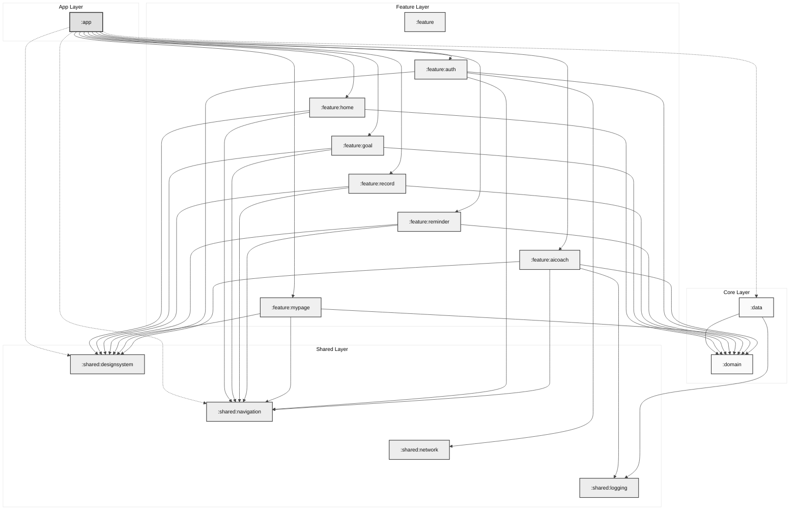

# 🏃‍♂️ FitFlow

**FitFlow는 러닝 트래킹과 AI 자세 코칭을 동등한 핵심 축으로 갖는 통합 운동 관리 앱입니다.**

---

## 개요

- 발표 자료: https://www.figma.com/deck/vx8fbnPPDtoaYrsddBK4Kb
- 개발 기간: 2025.12.-2026.01.
- 개발 인원: 1인 개발
- 현재 상태: 마켓 등록 준비 중

### 문제 정의
운동 앱 사용자는 러닝 기록 관리와 근력 운동 자세 교정을 각각 다른 앱에서 수행하는 경우가 많아서, 기록 누락과 루틴 단절이 쉽게 발생합니다.

### 해결 방식
FitFlow는 러닝 측정, AI 기반 자세 코칭, 목표 설정, 리마인더를 하나의 앱 흐름으로 묶어서 운동 루틴을 일관되게 유지하도록 구성되어 있습니다.

### 러닝과 AI 코칭을 통합한 이유
러닝은 거리, 시간, 페이스 같은 정량 지표 중심의 관리가 중요하고, 자세 코칭은 동작 품질 중심의 피드백이 중요합니다. FitFlow는 이 두 축을 동시에 제공하여 사용자가 유산소와 근력 운동을 같은 계정과 같은 내비게이션 구조 안에서 관리할 수 있도록 설계되어 있습니다.

---

## 주요 기능

### 러닝 트래킹
- 포그라운드 서비스 기반으로 러닝을 시작하고 종료할 수 있습니다.
- 위치 업데이트를 받아 이동 거리와 경과 시간을 계산하고 기록을 저장합니다.
- 활동 인식 API를 통해 달리기, 걷기, 정지 등 상태를 수집하고 화면에 반영합니다.
- 홈 화면에서 일간, 주간, 월간 단위 통계와 활동 로그를 확인할 수 있습니다.

### AI 자세 코칭
- CameraX와 ML Kit Pose Detection을 사용해 카메라 프레임에서 자세를 분석합니다.
- 스쿼트와 런지 동작에 대해 반복 횟수, 자세 피드백, 진행 상태를 제공합니다.
- 운동 세션 결과를 저장하고 음성 피드백 흐름을 지원합니다.

### 목표 및 리마인더
- 주간 목표 거리 설정과 수정이 가능합니다.
- 요일과 시간을 기준으로 리마인더 알람을 예약하고 취소할 수 있습니다.
- 알림 채널을 생성하고 예약 시점에 운동 알림을 표시합니다.

---

## 기능 시연

### AI 자세 코칭

| 전신 화면 요청 | 런지 측정 | 스쿼트 측정 |
| :---: | :---: | :---: |
|  |  |  |

### 러닝 및 활동 기록

| 러닝 시작 및 백그라운드 동작 | 홈 화면 활동 기록 | 주간 목표 설정 |
| :---: | :---: | :---: |
|  |  |  |

| 일간 주간 월간 통계 | 통계 달력 확인 |
| :---: | :---: |
|  |  |

### 인증 및 온보딩

| 개인정보처리방침 | 네트워크 권한 요청 | 권한 허용 |
| :---: | :---: | :---: |
|  |  |  |

| 닉네임 유효성 검사 | 중복 닉네임 처리 | 회원가입 완료 |
| :---: | :---: | :---: |
|  |  |  |

### 설정 및 마이페이지

| 알림 설정 | 알림 확인 | 다크모드 |
| :---: | :---: | :---: |
|  |  |  |

| 마이페이지 회원 탈퇴 |
| :---: |
|  |

---

## 기술 스택

- 언어 및 빌드
  - Kotlin 2.2.21
  - Java 21, JVM 타깃 21
  - Android Gradle Plugin 8.13.2
  - KSP 2.2.21-2.0.4
- Android UI 및 아키텍처
  - Jetpack Compose
  - Navigation Compose
  - AndroidX Lifecycle, ViewModel
  - 멀티 모듈 + Clean Architecture + MVVM
- 비동기 및 직렬화
  - Kotlin Coroutines, Flow
  - Kotlinx Serialization JSON
- 의존성 주입
  - Hilt
- 데이터 및 네트워크
  - Room
  - Firebase Authentication
  - Firebase Firestore
  - Firebase Functions
- 디바이스 기능
  - Play Services Location
  - Activity Recognition
  - CameraX
  - ML Kit Pose Detection
- 기타
  - LeakCanary

---

## 아키텍처

### 모듈 구성
아래 모듈 목록은 현재 Gradle 설정과 동일합니다.

- `:app`
- `:domain`
- `:shared:designsystem`
- `:shared:navigation`
- `:data`
- `:feature`
- `:feature:home`
- `:feature:goal`
- `:feature:record`
- `:feature:reminder`
- `:feature:mypage`
- `:feature:aicoach`
- `:feature:auth`
- `:shared:network`
- `:shared:logging`

### 구조 설명
- `:app` 모듈은 실제 실행 진입점이며 내비게이션과 기능 모듈을 통합합니다.
- `:domain` 모듈은 엔티티와 유스케이스 중심의 순수 비즈니스 계층입니다.
- `:data` 모듈은 Room 및 Firebase 기반 저장소 구현을 포함합니다.
- `:feature:*` 모듈은 화면 단위 기능을 분리한 프레젠테이션 계층입니다.
- `:shared:*` 모듈은 디자인 시스템, 내비게이션, 네트워크 상태 감지, 로깅을 공통으로 제공합니다.
- `:feature` 모듈은 공통 피처 네임스페이스를 위한 모듈로 유지됩니다.

### 의존성 구조 다이어그램

---

## 권한

아래 권한은 Manifest에 선언되어 있으며 실제 기능과 연결되어 있습니다.

- `android.permission.ACCESS_FINE_LOCATION`, `android.permission.ACCESS_COARSE_LOCATION`
  - 러닝 트래킹에서 위치를 수집하여 거리와 속도를 계산할 때 사용합니다.
- `android.permission.ACTIVITY_RECOGNITION`, `com.google.android.gms.permission.ACTIVITY_RECOGNITION`
  - 활동 인식 리시버를 통해 걷기, 달리기, 정지 상태를 감지할 때 사용합니다.
- `android.permission.CAMERA`
  - AI 자세 코칭 화면에서 카메라 프리뷰와 포즈 분석에 사용합니다.
- `android.permission.POST_NOTIFICATIONS`
  - 러닝 진행 상태 및 리마인더 알림을 표시할 때 사용합니다.
- `android.permission.SCHEDULE_EXACT_ALARM`
  - 요일 및 시간 기반 리마인더를 정확한 시각에 예약할 때 사용합니다.
- `android.permission.FOREGROUND_SERVICE`, `android.permission.FOREGROUND_SERVICE_LOCATION`
  - 러닝 위치 추적을 포그라운드 서비스로 유지할 때 사용합니다.
- `android.permission.INTERNET`, `android.permission.ACCESS_NETWORK_STATE`
  - Firebase 연동 및 네트워크 연결 상태 확인에 사용합니다.

---

## 설정 및 실행 방법

1. Android Studio에서 이 프로젝트 루트를 엽니다.
2. Gradle 동기화를 수행합니다.
3. `gradle.properties`에 `PRIVACY_POLICY_URL` 값이 설정되어 있는지 확인합니다.
4. Firebase 연동이 필요한 환경에서는 앱 모듈에 `google-services.json` 파일을 추가합니다.
5. 에뮬레이터 또는 실제 기기에서 앱 모듈을 실행합니다.

---

## 향후 개선 방향

- 러닝 기록과 AI 코칭 기록을 결합한 통합 대시보드를 고도화하여 운동 맥락을 더 쉽게 비교할 수 있도록 개선할 예정입니다.
- 리마인더 스케줄 정책을 확장하여 사용자 패턴 기반 추천 시간을 제공할 예정입니다.
- 오프라인 상황에서의 동기화 재시도 정책과 충돌 처리 전략을 세분화할 예정입니다.
- AI 코칭 동작 종류를 확장하고 자세 피드백의 개인화 강도를 조절할 수 있도록 개선할 예정입니다.
- 다국어 및 접근성 설정을 강화하여 더 넓은 사용자 환경을 지원할 예정입니다.

---

## 라이선스

현재 저장소에는 별도의 LICENSE 파일이 포함되어 있지 않습니다.
