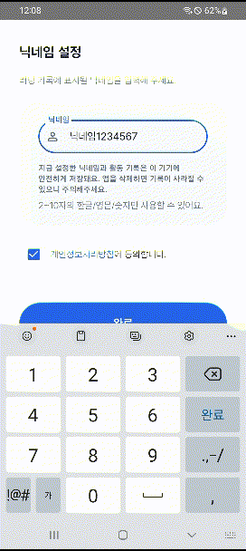
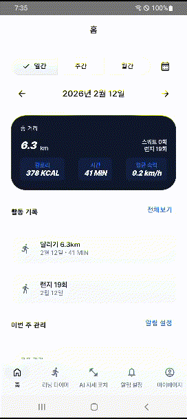

# 🏃‍♂️ RunningGoalTracker

[](https://kotlinlang.org)
[](https://github.com/google/ksp)
[]()
[]()
[]()
[]()
[](https://developer.android.com/jetpack/compose)
[](https://dagger.dev/hilt/)

**RunningGoalTracker**는 사용자의 러닝 목표를 설정하고 관리하며, 안드로이드의 활동 인식 기능을 통해 러닝 상태를 실시간으로 모니터링하는 앱입니다. MVVM을 적용한 Clean Architecture를 준수하였습니다.

---

## 📝 프로젝트 개요

- **앱 이름**: `RunningGoalTracker`
- **목적**: 사용자가 꾸준히 러닝 습관을 형성하고 목표를 달성할 수 있도록 돕는 동기부여 앱입니다. 실시간 활동 인식을 통해 정확한 운동 상태를 추적하고, 개인화된 목표 설정과 스마트 리마인더 기능이 있습니다.
- **개발 기간**: 2025.12.-2026.01.
- **개발 인원**: 1인 개발

---

## 🛠️ 기술 스택 (Tech Stack)

- **Language**: [Kotlin](https://kotlinlang.org/) (JVM 21)
- **UI**: [Jetpack Compose](https://developer.android.com/jetpack/compose) (BOM 기반 최신 버전)
- **Dependency Injection**: [Hilt (Dagger Hilt)](https://dagger.dev/hilt/)
- **Database**: [Room](https://developer.android.com/training/data-storage/room)
- **Architecture**: MVVM, Clean Architecture, Multi Module, Hybrid (Layered + Feature-based) Architecture
- **Asynchronous**: [Coroutines & Flow](https://kotlinlang.org/docs/coroutines-guide.html)
- **Libraries**:
  - [Play Services Location & Activity Recognition](https://developer.android.com/training/location)
  - [Navigation Compose](https://developer.android.com/jetpack/compose/navigation)

---

## ✨ 주요 기능 (Core Features)

- **🤖 AI 코칭**: Pose Detection을 활용하여 런지, 스쿼트 등 운동 횟수를 측정합니다.
- **🏃 활동 인식 모니터링**: 사용자의 현재 상태(걷기, 달리기, 정지 등)를 실시간으로 추적합니다.
- **📊 러닝 기록 관리**: 운동 시간, 거리, 속도 등을 저장하고 시각화된 통계를 제공합니다.
- **🎯 목표 설정**: 주간 단위 목표를 설정하고 달성률을 확인할 수 있습니다.
- **🔔 스마트 리마인더**: 설정한 시간에 맞춰 운동 알림을 제공합니다.

---

## 📱 기능 시연 (Key Features)

### 🤖 AI 코칭 (Pose Detection)
| 전신 화면 요청 | 런지 측정 | 스쿼트 측정 |
| :---: | :---: | :---: |
|  |  |  |

### 🏃 러닝 및 활동 기록
#### [활동 시작 및 목표 설정]
| 러닝 시작 및 백그라운드 | 홈 화면 활동 기록 | 주간 목표 설정 |
| :---: | :---: | :---: |
|  |  |  |

#### [데이터 분석 및 통계]
| 일간/주간/월간 통계 | 통계 달력 확인 |
| :---: | :---: |
|  |  |

### 🔑 인증 및 초기 설정
#### [권한 및 정책]
| 개인정보처리방침 | 네트워크 권한 요청 | 권한 허용 |
| :---: | :---: | :---: |
|  |  |  |

#### [계정 생성 및 검사]
| 닉네임 유효성 검사 | 중복 닉네임 처리 | 회원가입 완료 |
| :---: | :---: | :---: |
|  |  |  |

### ⚙️ 설정 및 기타
#### [알림 관리]
| 알림 설정 | 알림 확인 |
| :---: | :---: |
|  |  |

#### [앱 설정 및 계정]
| 다크모드 | 마이페이지 회원 탈퇴 |
| :---: | :---: |
|  |  |

---

## 프로젝트 구조 (Module Architecture)

```
:app
 ├── :feature
 │   ├── :home
 │   ├── :goal
 │   ├── :record
 │   ├── :reminder
 │   ├── :aicoach
 │   ├── :auth
 │   └── :mypage
 ├── :data
 ├── :domain
 └── :shared
     ├── :designsystem
     ├── :navigation
     └── :network
```

- **`:domain`**: 순수 Kotlin 모듈로, 앱의 핵심 비즈니스 로직(UseCase, Entity)을 포함합니다. 다른 모듈에 대한 의존성이 없습니다.
- **`:data`**: 데이터 소스(Local-Room)를 관리하고, `domain` 모듈의 Repository 인터페이스를 구현합니다.
- **`:feature`**: 각 화면(Home, Goal, Record, Reminder)에 해당하는 기능 단위 모듈입니다. `domain`과 `shared:designsystem` 모듈에 의존합니다.
- **`:shared:designsystem`**: 공통으로 사용되는 UI 컴포넌트, 테마, 색상, 폰트 등을 정의하는 모듈입니다.
- **`:app`**: 최종 애플리케이션 모듈로, 위 모듈들을 통합하여 완전한 앱을 구성합니다.

### 의존성 구조 다이어그램 (Dependency Graph)



---

## 🚀 설치 방법 (Installation)

1. **Repository 복제**:
   ```bash
   git clone https://github.com/your-username/RunningGoalTracker.git
   ```
2. **Android Studio에서 열기** 및 **Gradle 동기화**

---

## 🔒 필수 권한 설정

1. **활동 인식 (Activity Recognition)**: 실시간 활동 추적
2. **위치 정보 (Location)**: 경로 및 거리 측정
3. **알림 (Notification)**: 운동 독려 및 서비스 상태 유지
